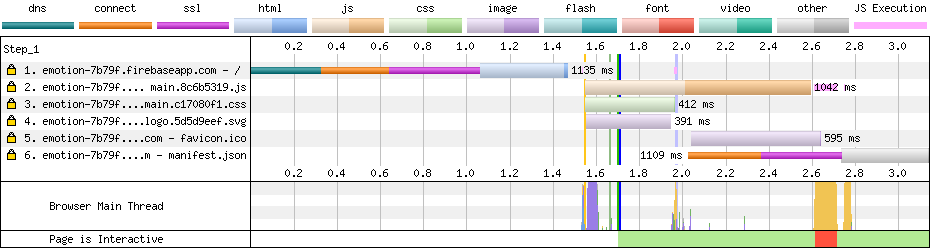
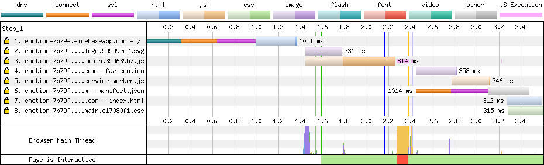

# Experiment

Experiment for discussion https://github.com/stereobooster/react-snap/issues/78

Testing with https://www.webpagetest.org.  **From**: Dulles, VA - Moto G4 - Chrome - 3G

**Hosting**: firebase


## snapshotify

```
git checkout snapshotify
yarn deploy
```

| Load Time | First Byte | Start Render | Speed Index | First Interactive (beta) | Time   | Requests | Bytes In | Time   | Requests | Bytes In | Cost  |
|-----------|------------|--------------|-------------|--------------------------|--------|----------|----------|--------|----------|----------|-------|
| 2.201s    | 1.425s     | 1.684s       | 1719        | 2.607s                   | 2.201s | 4        | 52 KB    | 3.297s | 6        | 57 KB    | $---- |




## react-snap

```
git checkout react-snap
yarn deploy
```

**Note**: there is a slight difference in the first byte, this is due to network fluctuation not because of tools difference. Differnce is 0.075s adjust all other times acordingly.

| Load Time | First Byte | Start Render | Speed Index | First Interactive (beta) | Time   | Requests | Bytes In | Time   | Requests | Bytes In | Cost  |
|-----------|------------|--------------|-------------|--------------------------|--------|----------|----------|--------|----------|----------|-------|
| 2.168s    | 1.352s     | 1.594s       | 1612        | 2.392s                   | 2.168s | 3        | 44 KB    | 3.275s | 8        | 54 KB    | $---- |





